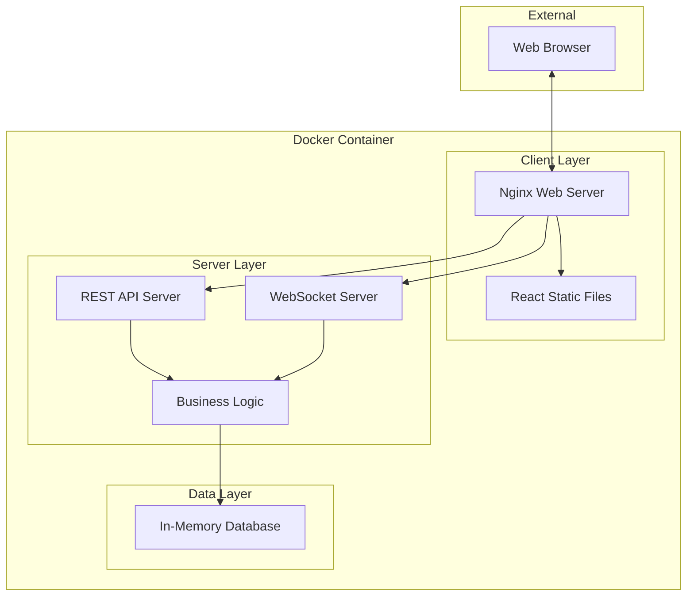

# Design Document: Planning Poker System

## Overview

The Planning Poker System is a real-time collaborative web application that enables development teams to estimate story points using the Planning Poker technique. The system provides isolated rooms for different teams, real-time synchronization of player actions, and an intuitive card-based interface that mimics physical Planning Poker cards.

The architecture follows a client-server model with WebSocket-based real-time communication, ensuring immediate updates across all participants in a room. The system emphasizes simplicity with a fixed Planning Poker deck and streamlined workflow focused on individual story estimation rounds.

## Architecture

### High-Level Architecture



### Deployment Architecture

**Single Container Deployment**: The application is packaged as a single Docker container containing:
- **Nginx**: Serves React static files and proxies API/WebSocket requests
- **Node.js Backend**: Handles API endpoints and WebSocket connections
- **In-Memory Database**: Fast, reliable state management for Planning Poker sessions

**Production Features**:
- Health check endpoints (`/health`)
- Graceful shutdown handling
- Automatic process management
- Security headers and caching
- WebSocket proxy configuration

### Communication Patterns

### Communication Patterns

**Real-time Communication**: WebSockets provide full-duplex communication with automatic reconnection:
- **Robust Reconnection**: Up to 10 automatic attempts with exponential backoff
- **Manual Fallback**: Persistent retry every 10 seconds if automatic reconnection fails
- **Auto-Rejoin**: Automatically rejoins rooms after successful reconnection
- **State Preservation**: Maintains room and player state during disconnections

**Enhanced Connection Management**: 
- Connection status indicators for users
- Graceful handling of server restarts
- Seamless user experience during network issues

## Components and Interfaces

### Frontend Components

#### Room Management Component
- **Purpose**: Handle room creation, joining, and configuration
- **Interface**: 
  - `createRoom(roomName: string): Promise<Room>`
  - `joinRoom(roomId: string, playerName: string): Promise<void>`
  - `leaveRoom(): void`

#### Planning Poker Game Component
- **Purpose**: Main game interface for estimation rounds
- **Interface**:
  - `startEstimationRound(): void`
  - `selectCard(cardValue: string): void`
  - `revealCards(): void`

#### Card Selection Component
- **Purpose**: Display and handle Planning Poker card interactions
- **Interface**:
  - Cards: `['0.5', '1', '2', '3', '5', '8', '13', '21', '?', '☕']`
  - `onCardSelect(cardValue: string): void`
  - Visual states: unselected, selected, revealed

#### Player Status Component
- **Purpose**: Show player list and their voting status with management capabilities
- **Interface**:
  - `displayPlayers(players: Player[]): void`
  - `onRemovePlayer(playerId: string): void`
  - Status indicators: connected, voted, disconnected
  - **Remove Player Feature**: Remove disconnected players from room with ✕ button
  - Visual distinction between connected and disconnected players
  - Integrated into room header for better accessibility

#### Results Display Component
- **Purpose**: Display revealed estimation results with statistics and visualizations
- **Interface**:
  - `displayResults(result: EstimationResult): void`
  - Shows player cards with names and values
  - Displays statistical information (average, median, range)
  - **Pie Chart Visualization**: Color-coded pie chart showing vote distribution
  - **Consensus Handling**: Special rendering for 100% consensus (colored circle)
  - Variance highlighting for discussion prompts

### Backend Services

#### Room Service
- **Purpose**: Manage room lifecycle and player membership
- **Interface**:
  - `createRoom(roomName: string): Room`
  - `addPlayer(roomId: string, player: Player): void`
  - `removePlayer(roomId: string, playerId: string): void`
  - `getRoomState(roomId: string): RoomState`
  - **User State Preservation**: Reuses existing player objects on rejoin
  - **Voting State Cleanup**: Properly cleans up votes when players leave

#### Estimation Service
- **Purpose**: Handle estimation round logic and card management
- **Interface**:
  - `startRound(roomId: string): void`
  - `submitCard(roomId: string, playerId: string, cardValue: string): void`
  - `revealCards(roomId: string): EstimationResult`

#### WebSocket Service
- **Purpose**: Manage real-time communication and event broadcasting
- **Interface**:
  - `broadcastToRoom(roomId: string, event: Event): void`
  - `sendToPlayer(playerId: string, event: Event): void`
  - `handleRemovePlayer(playerId: string): void`
  - Connection management and room subscription
  - **Enhanced Reconnection**: Automatic reconnection with manual fallback
  - **Player Management**: Remove disconnected players functionality

## Data Models

### Core Entities

```typescript
interface Room {
  id: string;
  name: string;
  createdAt: Date;
  players: Player[];
  currentRound?: EstimationRound;
}

interface Player {
  id: string;
  name: string;
  isConnected: boolean;
  joinedAt: Date;
}

interface EstimationRound {
  cards: Map<string, string>; // playerId -> cardValue
  isRevealed: boolean;
  startedAt: Date;
}

interface EstimationResult {
  cards: Array<{playerId: string, playerName: string, cardValue: string}>;
  statistics: {
    average: number;
    median: string;
    range: string[];
    hasVariance: boolean;
  };
}
```

### WebSocket Events

```typescript
// Client to Server Events
interface ClientEvents {
  'join-room': {roomId: string, playerName: string};
  'start-round': {};
  'select-card': {cardValue: string};
  'reveal-cards': {};
  'remove-player': {playerId: string};
}

// Server to Client Events
interface ServerEvents {
  'room-joined': {room: Room, estimationResult?: EstimationResult};
  'player-joined': {player: Player};
  'player-left': {playerId: string};
  'player-removed': {playerId: string};
  'round-started': {};
  'card-selected': {playerId: string, hasSelected: boolean};
  'cards-revealed': {result: EstimationResult};
  'error': {message: string};
}
```

## Correctness Properties

*A property is a characteristic or behavior that should hold true across all valid executions of a system-essentially, a formal statement about what the system should do. Properties serve as the bridge between human-readable specifications and machine-verifiable correctness guarantees.*

### Property 1: Room Identifier Uniqueness
*For any* set of rooms created by the system, all room identifiers should be unique across the entire system
**Validates: Requirements 1.1**

### Property 2: Room Configuration Persistence
*For any* room created with a name, retrieving that room should return the same configuration that was originally saved
**Validates: Requirements 1.2, 1.3**

### Property 3: Room Isolation
*For any* two different rooms with different players, actions performed in one room should not affect the state, notifications, or visibility of content in the other room
**Validates: Requirements 1.4, 3.2, 3.3, 5.1**

### Property 4: Round State Management
*For any* estimation round, the system should properly transition through states (started → cards selectable → revealed → new round possible) and clear previous state when starting new rounds
**Validates: Requirements 2.1, 2.2, 5.4**

### Property 5: Player Join Process
*For any* valid room link and player name, the system should successfully add the player to the room and make them visible to other players in that room
**Validates: Requirements 3.1**

### Property 6: Connection State Management
*For any* player who disconnects and reconnects, their room membership and current round state should be preserved and restored upon reconnection
**Validates: Requirements 3.4, 3.5**

### Property 7: Standard Deck Display
*For any* active estimation round, all players in the room should see the complete standard Planning Poker deck: 0.5, 1, 2, 3, 5, 8, 13, 21, ?, ☕
**Validates: Requirements 4.1**

### Property 8: Card Selection Privacy and Status
*For any* player's card selection before reveal, the selection should be recorded and status should be visible to others, but the actual card value should remain hidden from other players
**Validates: Requirements 4.2, 4.4**

### Property 9: Card Selection Updates
*For any* player who changes their card selection before reveal, the system should update their recorded selection and reflect the change in their status
**Validates: Requirements 4.3**

### Property 10: Estimation Completion Detection
*For any* room where all players have selected cards, the system should notify all players that estimation is complete
**Validates: Requirements 4.5**

### Property 11: Statistical Calculation Accuracy
*For any* set of revealed cards with numeric values, the calculated average, median, and range should be mathematically correct
**Validates: Requirements 5.2**

### Property 12: Variance Detection
*For any* set of revealed cards with significant differences in values, the system should highlight the variance for discussion
**Validates: Requirements 5.3**

### Property 13: Real-time Updates
*For any* state change in a room (player join/leave, card selection, round state change, card reveal), all connected players in that room should receive immediate notifications of the change
**Validates: Requirements 6.1, 6.2, 6.3, 6.4**

### Property 14: Connection Recovery
*For any* player who loses connection, the system should attempt to reconnect and restore their current room and estimation round state
**Validates: Requirements 6.5**

### Property 15: Visual Feedback Consistency
*For any* player's card selection, the system should provide immediate visual feedback showing their selection state and appropriate status indicators
**Validates: Requirements 7.2, 7.3**

### Property 16: Revealed Card Information Completeness
*For any* revealed estimation result, the display should include each player's name, their selected card value, and any required highlighting for estimation patterns
**Validates: Requirements 7.4**

### Property 17: User State Preservation on Rejoin
*For any* player who disconnects and rejoins a room, their existing player object should be reused to preserve voting history and identity
**Validates: Requirements 3.6**

### Property 18: Voting State Cleanup on Player Removal
*For any* player who is removed from a room, their voting state should be completely cleaned up to prevent duplicate votes
**Validates: Requirements 3.7**

### Property 19: Estimation Results Persistence on Rejoin
*For any* player who rejoins during the results phase, they should immediately see the current estimation results
**Validates: Requirements 3.5**

### Property 20: Remove Player Functionality
*For any* disconnected player in a room, other connected players should be able to remove them using a remove button
**Validates: Requirements 7.7**

### Property 21: Docker Container Deployment
*For any* deployment using the provided Docker configuration, the application should successfully serve both frontend and backend through a single container
**Validates: Requirements 8.1, 8.2, 8.3, 8.4, 8.5, 8.6, 8.7**

### Property 22: Robust Reconnection System
*For any* connection loss scenario, the system should attempt automatic reconnection and provide manual fallback options
**Validates: Requirements 6.5, 6.6, 6.7**

## Error Handling

### Connection Errors
- **WebSocket Disconnection**: Implement automatic reconnection with exponential backoff
- **Failed Reconnection**: Show user-friendly error message and provide manual reconnect option
- **Network Timeout**: Display connection status indicator and queue actions for retry

### Room Management Errors
- **Invalid Room ID**: Return clear error message when attempting to join non-existent room
- **Room Full**: Handle maximum player limits gracefully with appropriate messaging
- **Duplicate Player Names**: Allow duplicate names but distinguish with unique identifiers

### Estimation Round Errors
- **Invalid Card Selection**: Validate card values against the standard deck
- **Actions in Wrong State**: Prevent card selection when round is not active
- **Round Transitions**: Ensure proper state clearing when starting new rounds

### Data Validation
- **Room Name Validation**: Enforce reasonable length limits and character restrictions
- **Story Input Validation**: Validate story title and description for length and content
- **Player Name Validation**: Sanitize input and enforce reasonable constraints

### Graceful Degradation
- **Partial Connectivity**: Allow read-only mode when WebSocket fails but HTTP works
- **Browser Compatibility**: Provide fallback for browsers without WebSocket support

## Testing Strategy

### Dual Testing Approach
The system will use both unit testing and property-based testing to ensure comprehensive coverage:

- **Unit Tests**: Verify specific examples, edge cases, and error conditions
- **Property Tests**: Verify universal properties across all inputs using randomized test data
- Both approaches are complementary and necessary for complete validation

### Property-Based Testing Configuration
- **Testing Library**: Use a property-based testing library appropriate for the chosen implementation language
- **Test Iterations**: Minimum 100 iterations per property test to ensure thorough coverage
- **Test Tagging**: Each property test must reference its corresponding design document property
- **Tag Format**: `Feature: story-point-voting, Property {number}: {property_text}`

### Unit Testing Focus Areas
- **WebSocket Event Handling**: Test specific event sequences and error scenarios
- **Room State Transitions**: Verify correct state changes for specific scenarios
- **Statistical Calculations**: Test edge cases like all same values, empty sets, non-numeric cards
- **UI Component Behavior**: Test specific user interactions and visual state changes

### Property Testing Focus Areas
- **Room Isolation**: Generate multiple rooms with random players and verify isolation
- **State Persistence**: Test random disconnection/reconnection scenarios
- **Card Selection Privacy**: Verify privacy across random player and card combinations
- **Real-time Synchronization**: Test random sequences of player actions
- **Statistical Accuracy**: Verify calculations across random card combinations

### Integration Testing
- **End-to-End Scenarios**: Test complete Planning Poker sessions from room creation to completion
- **Multi-Player Scenarios**: Simulate multiple concurrent players in different rooms
- **Network Conditions**: Test behavior under various network conditions and failures
- **Browser Compatibility**: Verify functionality across different browsers and devices

### Performance Testing
- **Concurrent Rooms**: Test system behavior with multiple active rooms
- **WebSocket Load**: Verify performance under high message frequency
- **Memory Usage**: Monitor for memory leaks in long-running sessions
- **Response Times**: Ensure real-time updates meet latency requirements

<function_calls>
<invoke name="prework">
<parameter name="featureName">story-point-voting